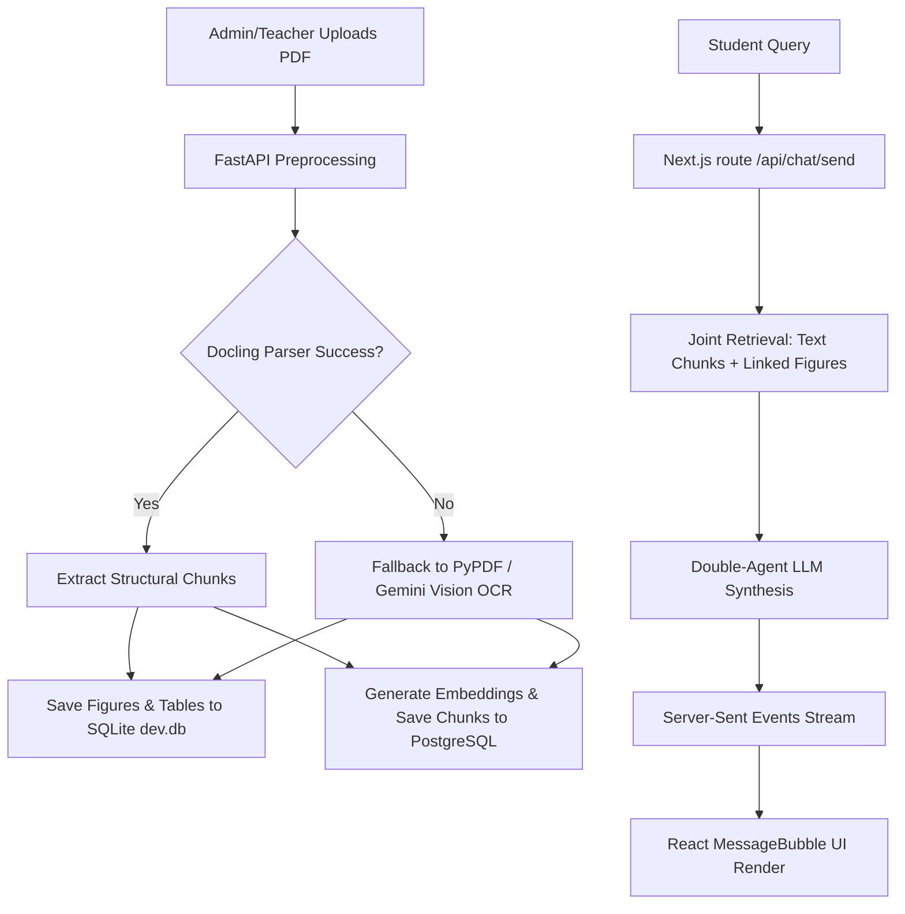

# SyllabIQ (Syllabus-Aware Multi-Modal QA & Ingestion System)

SyllabIQ is a state-of-the-art syllabus-aware academic question-answering and document-ingestion platform. It combines joint multi-modal RAG search, intelligent PDF parsing, selective figure extraction, auto-indexing into PostgreSQL (pgvector), and an interactive student-teacher interface featuring grounded study packs, citations, and comparison viewers.

---

## 🚀 Key Features

* **Multi-Modal Document Ingestion**: Selectively extracts figures, mathematical equations, and tabular datasets from syllabus/textbook PDFs, converting them into optimized `.webp` artifacts with logo filtering and aspect-ratio validation.
* **Resilient Fallback Preprocessing**: Automatically runs selectable text extraction, failing over to local Docling page parsing or Gemini Vision OCR to guarantee no un-parsed pages.
* **Vector & Multimodal Search (RAG)**: Employs PostgreSQL `pgvector` hybrid retrieval (semantic cosine similarity + lexical trigram match) to retrieve text-only chunks and link relevant figures using SQLite metadata associations.
* **Full Ingestion Retry Interface**: Admin/Teacher UI supports retrying failed ingestion runs natively without re-uploading the source document.
* **Double-Agent Reasoning Engine**: Features a double-agent design (Reasoning & Response formatting) to prevent tool-calling hallucinations, ensuring extremely high confidence metrics.
* **Structured UI Components**: Natively renders images and structured tables below LLM answers, avoiding markdown parsing anomalies.

---

## 📂 Project Architecture



### Main Directories & Components

* `/` (Root): Core Python ingestion pipeline, orchestration agent, and settings.
  * [`main.py`](file:///e:/Soubhagya%20miss/pypy/main.py): FastAPI server exposing `/ingest` and `/retrieve` endpoints.
  * [`agent.py`](file:///e:/Soubhagya%20miss/pypy/agent.py): Two-agent orchestration reasoning loop.
  * [`chunk_and_push.py`](file:///e:/Soubhagya%20miss/pypy/chunk_and_push.py): The document processing, OCR, chunking, and PostgreSQL database ingestion system.
  * [`transformer.py`](file:///e:/Soubhagya%20miss/pypy/transformer.py): Local SentenceTransformer model configuration.
* `/frontend`: Next.js web application.
  * [`prisma/schema.prisma`](file:///e:/Soubhagya%20miss/pypy/frontend/prisma/schema.prisma): SQLite Database Schema (Sessions, Citations, Figures, Document metadata).
  * [`src/app/api/chat/send/route.ts`](file:///e:/Soubhagya%20miss/pypy/frontend/src/app/api/chat/send/route.ts): Orchestrator Route fetching joint retrieval contexts and streaming chat response SSE blocks.
  * [`src/components/chat/MessageBubble.tsx`](file:///e:/Soubhagya%20miss/pypy/frontend/src/components/chat/MessageBubble.tsx): Component rendering chat bubbles, study widgets, and figure cards.
  * [`src/hooks/useChatStream.ts`](file:///e:/Soubhagya%20miss/pypy/frontend/src/hooks/useChatStream.ts): Chat session connection hook parsing SSE chunks and metadata events.

---

## 🛠️ Installation & Setup

### Prerequisites
* Python 3.10+
* Node.js v18+ & npm
* PostgreSQL with `pgvector` extension (e.g., via Docker container)

### 1. Python Environment Setup
Install dependencies and activate the virtual environment:
```bash
# In the root directory
python -m venv .venv
.venv\Scripts\activate
pip install -r requirements.txt
```

Ensure your `.env` contains the required database settings and API keys:
```env
DB_NAME=syllabiq
DB_USER=postgres
DB_PASSWORD=yourpassword
DB_HOST=localhost
DB_PORT=5432
GEMINI_API_KEY=AIzaSy...
GROQ_API_KEY=gsk_...
```

### 2. Next.js Frontend Setup
Configure database migrations and install frontend dependencies:
```bash
cd frontend
npm install
npx prisma db push
```

Verify your `frontend/.env` variables:
```env
DATABASE_URL="file:./dev.db"
BACKEND_URL="http://localhost:8000"
JWT_SECRET=your_jwt_secret
```

---

## 💻 Running the Application

### Start Python Ingestion & Agent Backend
```bash
# Root directory
.venv\Scripts\activate
uvicorn main:app --host 0.0.0.0 --port 8000 --reload
```

### Start Next.js Frontend Dev Server
```bash
# frontend directory
npm run dev
```
Open [http://localhost:3000](http://localhost:3000) to access the application.

---

## 🔍 Ingestion Pipeline Details

The ingestion process in [`chunk_and_push.py`](file:///e:/Soubhagya%20miss/pypy/chunk_and_push.py) goes through the following stages:

1. **`PARSING`**: Attempts Docling parser. If it throws a native exception, it falls back to native text extraction page-by-page.
2. **`OCR`**: Performs local OCR or calls Gemini Vision API if page readability checks show low selectable text ratios.
3. **`IMAGE_EXTRACTION`**: Extracts figures, scales them to max `1600px` width, converts them to `.webp` format, performs std-dev checks to exclude flat icons, filters duplicates by perceptual hash, and logs them in SQLite `Figure` table.
4. **`CHUNKING`**: Conducts document-level overlapping semantic paragraph grouping.
5. **`EMBEDDING`**: Generates vectors using the selected embedding backend (`local` SentenceTransformers or `gemini`).
6. **`INDEXING`**: Pushes chunks and embeddings to PostgreSQL.
7. **`READY` / `FAILED`**: Updates state to ready or writes out stack trace errors on fail.

---

## 🤝 Verification & Testing

* **Ingestion Verification**: Use `test_ingest.py` to test parsing specific PDF versions:
  ```bash
  python test_ingest.py
  ```
* **Chat Retrieval Verification**: Query the FastAPI retrieval endpoint manually:
  ```bash
  curl -X POST http://localhost:8000/retrieve -H "Content-Type: application/json" -d '{"query":"Explain bootstrap loader"}'
  ```
